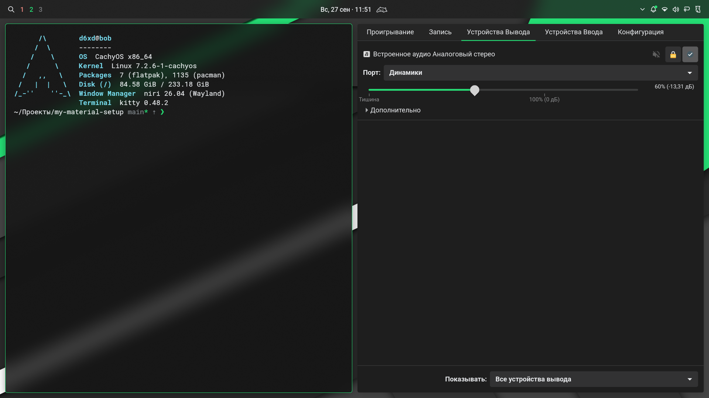

# Material 2 Green · Niri + Noctalia

[English](README.md) | **Русский**

[](https://cachyos.org)
[](https://github.com/YaLTeR/niri)
[](https://noctalia.dev)
[](LICENSE)

Мой тёмный райс для CachyOS и Arch Linux в стиле **Material Design 2**, вдохновлённый ChromeOS: графитовые поверхности, зелёный акцент, Roboto, небольшие скругления и мягкие тени. В основе — прокручиваемый тайлинг Niri и оболочка Noctalia.

Цвет `#25E075` взят с зелёных геометрических обоев. Он объединяет панель, выделение текста, рамку активного окна, терминал и тему Telegram.



## Что внутри

| Компонент | Настройка |
|---|---|
| Окна | Niri: скругления 4 px, зазоры 12 px, рамка фокуса 2 px и тени для глубины |
| Анимации | Кривые Material 2: окна вырастают с 90% с проявлением и закрываются быстрее, чем открываются |
| Оболочка | Noctalia 5.1 с конфигурацией в TOML |
| Панель | Сверху, вплотную к краям экрана, высота 40 px, непрозрачность 78% |
| Рабочие пространства | Минимальные текстовые метки без иконки активного приложения |
| Меню | Сетка приложений, полупрозрачный центр управления и размытие фона |
| Терминал | Kitty: Roboto Mono Nerd Font, отступы 14 px, непрозрачность 82% |
| Командная оболочка | Fish + Pure: однострочный промпт, каталог и Git, красный индикатор ошибки |
| GTK 3/4 | `adw-gtk3-dark`, Material 2 CSS в цветах палитры, Roboto 11 и Papirus Dark |
| Qt | qt6ct с палитрой Noctalia, стиль Fusion, Roboto и Papirus Dark |
| Курсор | Bibata Modern Classic, размер 20 |
| Утилиты | Fastfetch, Btop, Cava и Vim в цветах палитры |
| Медиа | mpv со штатным OSC в цветах палитры и горячими клавишами, работающими и на русской раскладке |
| Редактор и мессенджер | Темы Zed и Discord из community-шаблонов Noctalia |
| Telegram Desktop | Отдельная тема Material 2 Green для ручного импорта |

Уведомления компактные, одновременно видны не более двух. Экран блокировки использует затемнённые обои и небольшое поле входа с индикаторами раскладки и Caps Lock. После 10 минут бездействия включается блокировка, после 20 минут гаснет экран.

Горячие клавиши запускают **Helium Browser** и **Thunar**. Helium сохраняет стандартное оформление. Центр управления настроен открываться рядом с местом нажатия на панели.

### Палитра

| Роль | Цвет |
|---|---|
| Основной фон | `#121212` |
| Поверхности | `#1E1E1E` — `#2C2C2C` |
| Акцент | `#25E075` |
| Текст | `#E8EAED` |

В репозитории также сохранены палитра **Material2-Blue** и обои Blue Paper.

`Mod+Shift+T` переключает тёмный и светлый режим. Noctalia заново рендерит все шаблоны цветов, поэтому за ним следуют оболочка, GTK, Qt, Kitty, Vim, mpv и остальное. Уже запущенные Fish сохраняют старые цвета, пока не откроете новый.

## Требования

Сетап рассчитан прежде всего на CachyOS. Для Arch Linux нужны совместимые версии Niri и Noctalia; пакет `noctalia` может потребоваться установить отдельно. Конфиги используют Noctalia 5.1 с командой `noctalia` и сборку Niri с поддержкой `blur` и `background-effect`.

Флаг `--install-packages` устанавливает через `pacman`:

```text
niri noctalia kitty fish fish-pure-prompt fish-autopair
fastfetch btop cava mpv vim papirus-icon-theme adw-gtk-theme qt6ct
ttf-roboto ttf-roboto-mono-nerd xwayland-satellite
xdg-desktop-portal-gnome xdg-desktop-portal-gtk
```

Для клонирования нужен `git`, для установщика — Bash, `curl` и `tar` с поддержкой `.xz`. Курсор загружается из GitHub, поэтому даже установка без пакетов требует подключения к сети.

Helium, Thunar и Telegram устанавливаются отдельно. Для демонстрации экрана нужен `xdg-desktop-portal-gnome`: портальный конфиг Niri отправляет запись экрана через него. Qt-приложения подхватывают qt6ct из `QT_QPA_PLATFORMTHEME`, который задаёт Niri, поэтому после установки перезайдите в сеанс.

## Установка

Склонируйте репозиторий и посмотрите план установки:

```bash
git clone https://github.com/v0dol4zik/my-material-setup.git
cd my-material-setup
bash ./install.sh --dry-run --install-packages
```

Для установки пакетов и конфигурации:

```bash
bash ./install.sh --install-packages
```

Если зависимости уже установлены, достаточно:

```bash
bash ./install.sh
```

Запускайте скрипт от своего пользователя. Для установки пакетов он сам вызывает `sudo pacman`; конфигурация записывается в домашний каталог.

### Что меняет установщик

- Копирует конфиги Niri, Noctalia, Kitty, Fish, Fastfetch, Btop, Cava, mpv и GTK 3/4 в `~/.config`.
- Устанавливает `home/vimrc` как `~/.vimrc`, а цветовую схему Vim — в `~/.vim/colors`.
- Загружает Bibata Modern Classic `v2.0.7` в `~/.icons` и делает его курсором по умолчанию в `~/.icons/default`.
- Записывает `~/.local/state/noctalia/settings.toml` с зелёной палитрой, обоями и шаблонами цветов, а также `~/.config/qt6ct/qt6ct.conf`.
- Задаёт курсор, иконки и шрифты через `gsettings`, чтобы порталы и диалоги GTK совпадали с остальным рабочим столом.
- Перед перезаписью сохраняет существующие конфиги, настройки Noctalia и курсор в резервную копию.

Расположение конфигов и состояния учитывает `XDG_CONFIG_HOME` и `XDG_STATE_HOME`. Приведённые здесь пути соответствуют стандартным значениям.

Установщик не настраивает SDDM или другой менеджер входа и не меняет оболочку пользователя на Fish. Чтобы попробовать Fish, выполните `fish` в терминале. Профиль Helium и тема Telegram автоматически не изменяются.

После установки проверьте конфигурацию:

```bash
niri validate
noctalia config validate
```

Затем выйдите из сеанса и войдите в Niri. Noctalia запускается из его автозагрузки. Уже открытые приложения GTK и терминалы нужно перезапустить для применения оформления.

## Горячие клавиши

`Mod` — клавиша **Super / Win**.

| Клавиши | Действие |
|---|---|
| `Mod+Return` | Kitty |
| `Mod+B` | Helium Browser |
| `Mod+E` | Thunar |
| `Mod+Ctrl+Return` | Меню приложений |
| `Mod+S` | Центр управления |
| `Mod+Shift+S` | Настройки Noctalia |
| `Mod+Shift+Return` | Выбор обоев |
| `Mod+Alt+L` | Заблокировать экран |
| `Mod+Shift+Q` | Меню сеанса |
| `Mod+Shift+T` | Переключить тёмный / светлый режим |
| `Mod+O` | Обзор окон и рабочих пространств |
| `Mod+H/J/K/L` или `Mod+стрелки` | Переключить фокус |
| `Mod+Ctrl+H/L` | Переместить колонку влево / вправо |
| `Mod+Ctrl+J/K` | Переместить окно вниз / вверх |
| `Mod+Q` | Закрыть окно |
| `Mod+F` | Развернуть колонку по ширине |
| `Mod+Shift+F` | Полноэкранный режим окна |
| `Mod+T` | Переключить плавающий режим окна |
| `Mod+W` | Переключить вкладки в колонке |
| `Mod+C` | Центрировать колонку |
| `Mod+Minus` / `Mod+Equal` | Уменьшить / увеличить ширину колонки на 10% |
| `Mod+1…9` | Перейти на рабочее пространство |
| `Mod+Ctrl+1…9` | Переместить колонку на рабочее пространство |
| `Mod+Tab` | Предыдущее рабочее пространство |
| `Mod+Shift+стрелки` | Переключить фокус между мониторами |
| `Mod+Ctrl+Shift+стрелки` | Переместить колонку на другой монитор |
| `Ctrl+Shift+1` / `2` / `3` | Снимок области / экрана / окна |
| `Alt+Shift` | Переключить раскладку US / RU |
| `Mod+Shift+Esc` | Открыть подсказку сочетаний клавиш |

В конфиге отключено автоматическое сохранение скриншотов в файл: они попадают в буфер обмена. Полный список сочетаний находится в [keybinds.kdl](config/niri/cfg/keybinds.kdl).

## Настройка под себя

Пути в таблице указаны относительно репозитория. Для установленного сетапа редактируйте соответствующие файлы в `~/.config`.

| Что изменить | Где |
|---|---|
| Панель и рабочие пространства | `config/noctalia/config.toml`: `[bar.main]`, `[widget.workspaces]` |
| Центр управления, прозрачность и тени | `config/noctalia/config.toml`: `[shell.panel]`, `[shell.shadow]`, `[control_center]` |
| Уведомления, блокировку и таймеры | `config/noctalia/config.toml`: `[notification]`, `[lockscreen_widgets]`, `[idle]` |
| Акцент и остальные цвета | `config/noctalia/palettes/Material2-Green.json` |
| Обои по умолчанию | `config/noctalia/wallpapers/material2-green.jpg` |
| Форму элементов GTK | `config/noctalia/templates/gtk3-material2.css`, `gtk4-material2.css` |
| Прозрачность и шрифт терминала | `config/kitty/kitty.conf` |
| Цвета Fish и Pure | `config/noctalia/templates/fish-colors.fish` |
| Настройки промпта Pure | `config/fish/config.fish` |
| Цвета Vim | `config/noctalia/templates/vim-colors.vim` |
| Горячие клавиши и раскладку | `config/niri/cfg/keybinds.kdl`, `config/niri/cfg/input.kdl` |
| Анимации | `config/niri/cfg/animation.kdl` |
| Правила окон и скрытие при записи экрана | `config/niri/cfg/rules.kdl` |
| Мониторы и масштабирование | `config/niri/cfg/display.kdl` |

Имена мониторов и доступные режимы можно посмотреть командой:

```bash
niri msg outputs
```

Пример монитора в `display.kdl` отключён через `/-`. Поле входа на экране блокировки привязано к `eDP-1`: для другого дисплея измените `output`, идентификатор `lockscreen-login-box@eDP-1` и его запись в `widget_order`. Положение и размер удобно настроить через интерфейс Noctalia.

Палитра фиксированная: смена обоев сама по себе не заменяет зелёный акцент. Noctalia применяет цвета к GTK, Qt, Kitty, Btop, Cava и Niri через встроенные шаблоны, к Zed и Discord через community-шаблоны, а ко всему остальному через пользовательские шаблоны ниже. Итоговый вид зависит от поддержки темы конкретным приложением.

При повторной установке скрипт снова применяет палитру, обои и настройки из репозитория. Чтобы сохранить свои изменения, сначала запустите `./sync.sh` (см. [ниже](#синхронизация-с-репозиторием)), а изменения состояния перенесите в [шаблон состояния](state/noctalia/settings.toml.in) вручную.

### Шаблоны цветов

Файлы в `config/noctalia/templates` — пользовательские шаблоны Noctalia, подключённые в `config.toml` секциями `[theme.templates.user.<id>]`. Noctalia рендерит их при каждой смене палитры или режима: форму элементов GTK (`material2.css`), цвета Fish и Pure, цветовую схему Vim и цвета mpv. Редактируйте шаблон, а не результат: следующий рендер его перезапишет. Отрендеренные копии в репозитории — тёмный вариант Material2-Green, запасной на случай первого запуска.

Чтобы добавить свой шаблон, положите его рядом с остальными и подключите:

```toml
[theme.templates.user.example]
input_path = "$XDG_CONFIG_HOME/noctalia/templates/example.conf"
output_path = "~/.config/example/colors.conf"
```

Пути пишите через `$XDG_CONFIG_HOME` или `~`. `$HOME` Noctalia не раскрывает, и шаблон с ним молча не рендерится. Цвета записываются как `{{colors.primary.default.hex}}` (также работают `hex_stripped`, `red`, `green` и `blue`), а `{{ mode }}` даёт `dark` или `light`. Токены поверхностей Noctalia вычисляет сама, значения палитры без изменений несут только токены `terminal_*`. Применить изменения:

```bash
noctalia msg config-reload
noctalia msg templates-apply
```

### Zed и Discord

Community-шаблон Zed пишет `~/.config/zed/themes/noctalia.json`. Чтобы тема следовала системному режиму, добавьте в `~/.config/zed/settings.json`:

```json
"theme": {
  "mode": "system",
  "light": "Noctalia Light",
  "dark": "Noctalia Dark"
}
```

Шаблон Discord кладёт темы для Vesktop, Vencord, BetterDiscord, Equicord, WebCord и других модов клиента в их папки тем; включите нужную в настройках тем клиента.

### Приватность при демонстрации экрана

Окна Telegram и уведомления Noctalia скрыты из записи экрана правилами в `rules.kdl`: зрители демонстрации видят на их месте чёрные прямоугольники. На скриншотах они остаются. Если это не нужно, удалите правила `block-out-from "screencast"`.

## Синхронизация с репозиторием

`install.sh` копирует файлы, а не делает ссылки, поэтому правки в `~/.config` остаются там. `sync.sh` переносит их обратно:

```bash
./sync.sh --dry-run   # показать отличающиеся файлы
./sync.sh             # скопировать их, затем проверить через git diff
```

Он обновляет только файлы, которые уже есть в репозитории; новые нужно скопировать вручную. Заготовки `*.in` и полные конфиги, которые сами пишут btop и cava, пропускаются. Результаты шаблонов копируются, только пока Noctalia в тёмном режиме на Material2-Green, то есть в том состоянии, которое записано в запасных копиях.

## Тема Telegram Desktop

Готовый файл: [Material2-Green.tdesktop-theme](themes/telegram/Material2-Green.tdesktop-theme).

В Telegram откройте **Настройки → Настройки чатов → меню темы → Выбрать из файла**, выберите архив и примените его после предпросмотра. Названия пунктов могут отличаться между версиями клиента.

Тема включает тёмные сообщения, зелёные акценты и спокойный геометрический фон чата. Подробности и исходники — в [themes/telegram](themes/telegram/README.md).

## Структура репозитория

```text
.
├── .github/workflows/         # CI: ShellCheck, niri validate, проверка темы Telegram
├── assets/                    # Скриншоты и обои от предыдущего сетапа
├── config/
│   ├── niri/                  # Конфиг композитора, сочетания клавиш и скрипты
│   ├── noctalia/              # Панель, меню, палитры, обои и шаблоны цветов
│   ├── kitty/                 # Терминал
│   ├── fish/                  # Настройки оболочки и отрендеренные цвета
│   ├── gtk-3.0/               # Оформление GTK 3
│   ├── gtk-4.0/               # Оформление GTK 4
│   ├── qt6ct/                 # Заготовка настроек Qt
│   ├── btop/                  # Системный монитор
│   ├── cava/                  # Аудиовизуализатор
│   ├── mpv/                   # Медиаплеер
│   └── fastfetch/             # Сведения о системе
├── home/                      # ~/.vimrc, цвета Vim и курсор по умолчанию
├── state/noctalia/            # Шаблон настроек темы и обоев
├── themes/telegram/           # Тема Telegram и её исходники
├── install.sh
├── sync.sh                    # Переносит правки из системы обратно в репозиторий
├── LICENSE
├── README.md
└── README.ru.md
```

## Резервные копии и откат

По умолчанию установщик сохраняет резервные копии в:

```text
~/.local/state/material2-noctalia-dotfiles/backups/<дата-время>/
```

Внутри сохраняется структура домашнего каталога: например, старый конфиг Niri находится в `.config/niri/`, а настройки темы Noctalia — в `.local/state/noctalia/settings.toml`.

Для отката завершите сеанс Niri, выберите нужную копию и верните сохранённые файлы на прежние места. Файлы, впервые добавленные сетапом, в старой копии отсутствуют — при полном откате их нужно убрать отдельно. Удаление установленных пакетов выполняется отдельно через пакетный менеджер.

## Авторы и лицензии

Конфигурация и установщик распространяются по [MIT](LICENSE).

- [Niri](https://github.com/YaLTeR/niri) — композитор Wayland.
- [Noctalia](https://noctalia.dev) — панель, меню, уведомления и экран блокировки.
- [Bibata Cursor](https://github.com/ful1e5/Bibata_Cursor) — тема курсора от ful1e5; установщик скачивает официальный архив релиза.
- [tgs266](https://www.deviantart.com/tgs266) — автор обоев **Dark Material Design Wallpaper 3 in 4K** (`dark_material_design_wallpaper_3_in_4k_by_tgs266_d9j9h5i.jpg`). Права на изображение принадлежат автору; MIT репозитория на него не распространяется.
- Для заимствованных частей палитры Telegram действуют условия upstream, описанные в [README темы](themes/telegram/README.md#attribution).
